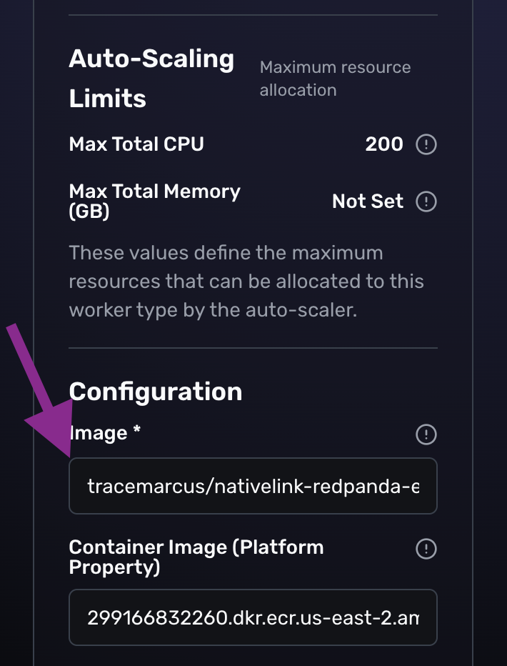

# Remote Execution in Nativelink Cloud

Remote execution of Redpanda in Nativelink Cloud has been tested and has been validated to work with the setup in this directory. 

### Enabling Remote Execution

To enable remote execution in Nativelink, developers need to take the following steps:

> [!NOTE]  
> Steps 1 and 2 require a lot of time and are not be necessary to get started. You can skip them and revisit in the future when you need to have a reproducible environment that you control.

1. (optional, and takes hours) Build the LLVM tar ball in this directory and compress it using zstd.

2. (optional, and takes minutes) Build the Dockerfile in this directory, which incorporates artifact produced in step 1. 

3. Create a cloud account at [dev.nativelink.com](https://dev.nativelink.com).

4. Copy the values in Quickstart and append them to the `.bazelrc` in your project.

Navigate to the the Remote Execution tab for steps 5 and 6.

5. Ensure that the last line in your `.bazelrc` matches the picture below, prefixed by `build`. This is the location of your Nativelink Scheduler.


_the underlined text should go to in the `.bazelrc`_

6. If you skipped steps 1 and 2, click `Advanced` and add the value for image under Configuration as `tracemarcus/nativelink-redpanda-executor:latest`, and under Container image as `299166832260.dkr.ecr.us-east-2.amazonaws.com/nativelink-rbe:27fa8eefb23040d7d7f6186dfe906c97ac18d235f9fe27bf160c9a0697750049`. If you did complete steps 1 and 2, enter the location of the Docker image you published for remote execution using a similar format, while the value of Container image stays the same.



7. Return to the `bazel/` dir on the command line and from there execute the following command:

 ```shell
 bazel build //...
 ```
> [!IMPORTANT]  
> This command may only complete successfully if issued from an x86_64/amd64 Linux machine.

## Known Improvements

1. It may be beneficial to incorporate the ideas from [Dockerfile.sysroot](../toolchains/Dockerfile.sysroot) to build a more hermetic toolchain.

2. The Docker image in this directory should pull the contents of [install-deps.sh](../install-deps.sh) dynamically, but today those dependencies are hard-coded for simplicity and illustration purposes.  

3. This documentation needs to improve and provide entirely reproducible steps so that users can recreate the exact same environment as the one introduced in these docs.

### Contact

If you have any questions, feel free to email the team at contact@tracemachina.com
